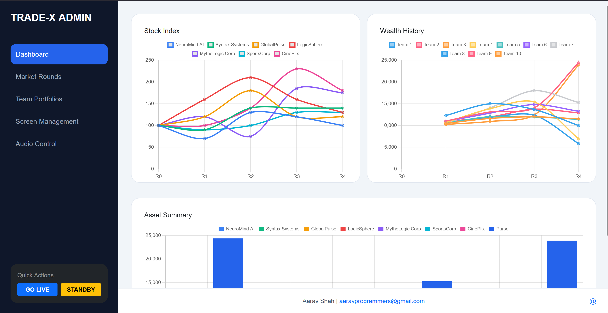
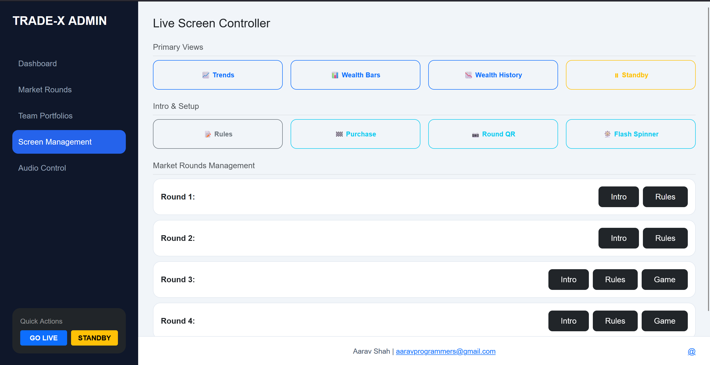
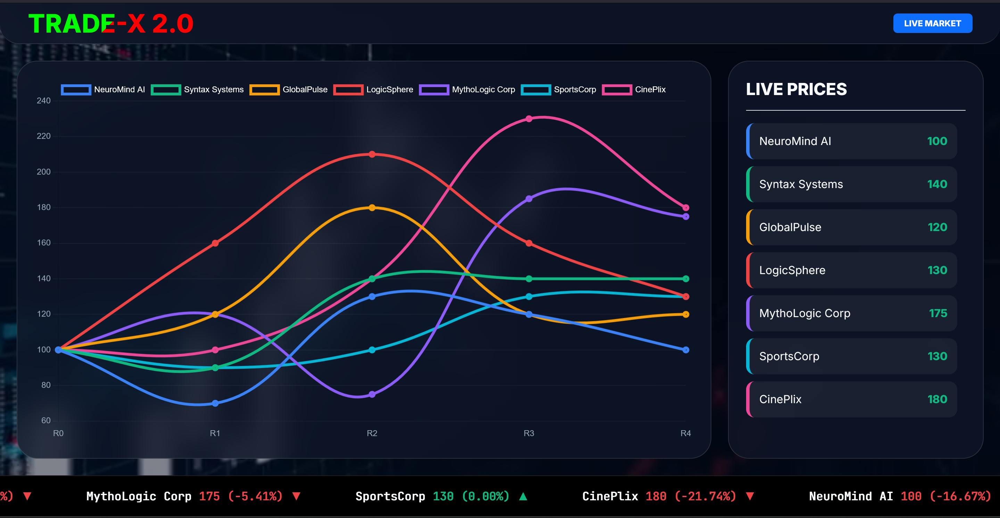
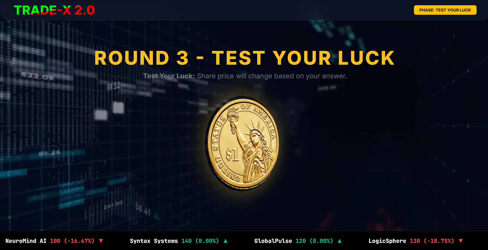

<h1 align="center">📈 Trade-X</h1>
<p align="center">
  <em>Live stock-market simulation platform for event rounds, team portfolios, auctions, and luck-based market events.</em>
</p>

<p align="center">
  
  
  
  
</p>

<p align="center">
  <a href="https://aaravshah1311.is-great.net" target="_blank" rel="noopener noreferrer">
    
  </a>
</p>

---

## 🚀 Overview

**Trade-X** is a full-stack simulation system designed for school/college trading events where teams buy virtual stocks and compete on total wealth.

The platform includes:
- 📺 a **live audience screen** (`/`) for market visuals,
- 🛠️ an **admin panel** (`/admin.html`) for controlling rounds,
- ⚡ **real-time sync** using Socket.IO,
- 🧠 dynamic **luck/question events** loaded from JSON,
- 💾 MySQL-backed persistence for teams, companies, and settings.

---

## ✨ Core Features

- 🏢 Multi-company market with per-round price changes
- 👥 Team portfolio + purse + total wealth tracking
- 🔄 Auto wealth recalculation after admin actions
- 🧾 Auction bid lock + resolve (correct/wrong multiplier)
- 🎲 Random and company-wise luck question draws
- 🖥️ Public screen mode + overlay sync controls
- 🔊 Built-in audio control panel (MP3/MP4 from `public/song`)

---

## 🖼️ Screenshots

<div align="center">
  
  
</div>

<p align="center">
  <sub><strong>Admin:</strong> Dashboard and controls</sub>
</p>

<div align="center">
  
  
</div>

<p align="center">
  <sub><strong>Public Display:</strong> Main market screen and question/luck round view</sub>
</p>

---

## 🧱 Project Structure

```text
Trade-X/
├── server.js                # Main backend (Express + APIs + socket sync)
├── db.sql                   # MySQL schema + seed data
├── public/
│   ├── index.html           # Participant screen
│   ├── admin.html           # Admin control panel
│   ├── song/                # MP3/MP4 tracks for audio control
│   └── screen/              # Round screens + questions.json + media
├── documents/               # Event docs
├── package.json
└── README.md
```

---

## ⚙️ Installation

### 1) Clone project

```bash
git clone https://github.com/aaravshah1311/Trade-X.git
cd Trade-X
```

### 2) Install dependencies

```bash
npm install
```

---

## 🗄️ Database Setup (MySQL)

Import schema and starter data:

```bash
mysql -u root -p < db.sql
```

This creates:
- `tradex_db` database
- `settings` table
- `companies` table
- `teams` table

---

## 🔐 Database Credentials (Important)

> ⚠️ **No `.env` is used in this project currently.**

Update your DB credentials **directly in `server.js`** inside `mysql.createPool(...)`:

```js
const pool = mysql.createPool({
  host: 'localhost',
  user: 'root',
  password: '',
  database: 'tradex_db'
});
```

Set your own MySQL `user` and `password` there before running.

---

## ▶️ Run the Application

```bash
node server.js
```

Open:
- Public screen: `http://localhost:3000/`
- Admin panel: `http://localhost:3000/admin.html`

---

## 🔌 API Endpoints

| Method | Endpoint | Purpose |
|---|---|---|
| GET | `/api/get_data` | Fetch settings, companies, teams |
| GET | `/api/get_songs` | List files in `public/song` |
| POST | `/api/admin/action` | Execute admin operations |
| GET | `/api/draw-luck` | Draw random unopened question |
| GET | `/api/get-question-counts` | Remaining unopened questions per company |
| GET | `/api/draw-company-luck?company=...` | Draw by company |

### Supported `action` values
- `update_round`
- `auction_lock_bids`
- `auction_resolve`
- `update_portfolio`
- `sync_screen`
- `sell_all`
- `add_team`

---

## 🧪 Quick Setup Checklist

- [ ] MySQL server is running
- [ ] `db.sql` imported successfully
- [ ] DB `user/password` updated in `server.js`
- [ ] `npm install` completed
- [ ] `node server.js` starts successfully

---

## 📌 Operational Notes

- `public/screen/questions.json` is updated during luck draws (`opened: true`), so reset it before a fresh event.
- Team `stocks` arrays should match company count/order.
- `server.js` includes `start` commands (Windows-style browser launch). On Linux/macOS, app still runs but auto-open behavior may not work.

---

## 👤 Author

**Aarav Shah**

- GitHub: https://github.com/aaravshah1311/
- Portfolio: https://aaravshah1311.is-great.net
- Email: aaravprogrammers@gmail.com

---

<div align="center">
  <sub>Built for high-energy trading events with real-time scoring and interactive rounds.</sub>
</div>
